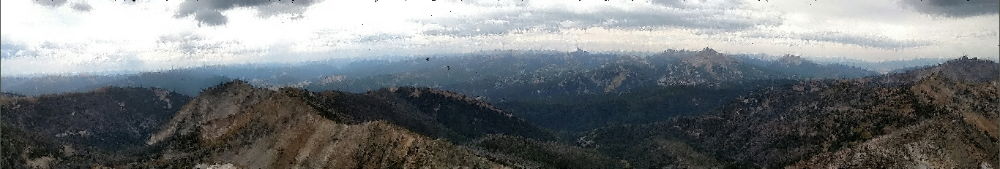

The image I chose is a panoramic picture I took from the top of Wilson Peak near Big Sky last August.
I like it because of how the landscape is reinterpreted with the polygons. The best settings I found
were lines, at the default size, with colors taken at each corner, and filled randomly. The colors
taken at corners helps to give a more paint like look to the image than each line being a solid color.
Since the panoramic is not a very good aspect ratio, I also included an image called pan small, which
is a piece of the panoramic at a better aspect ratio.

Original:

Rendered:

Controls

I created an arbitrary polygon generator so I could create shapes with any number of sides. I used this
for drawing shapes with sides 3 to 9 and the circle, which has 20 sides. The random lines are simply
15 lines with random angles centered around the clicked point.

Shape Controls:
+ 1- circles
+ 2- random lines centered about mouse click
+ 3-9- polygon with n sides

The uniform fill simply places a grid of shapes as close as possible without overlapping. The random
fill places shapes uniformly random over the image.

Fill Controls:
+ a- uniform fill
+ s- random fill

There are 4 re-sizing modes. The first 3 scale the image based on the dimensions. Fit width will ensure
that the entire image's x dimension fits in the window. Height ensures that the image's y dimension
fits. Both ensures the entire image always fits the window. No scaling will keep the image's original
dimensions, no matter what the window size is.

Re-sizing Controls:
+ z- fit width
+ x- fit height
+ c- fit both
+ v- no scaling

Finally, there are a few controls that don't fit in any category. Clear screen deletes all shapes. Reset
will change the setting to squares, fitting width and height, center color, no mouse follow, and size is
min(width, height) / 30. Center color means the shape is solidly the color at the center. Color at
corners means that each corner of the shape using the color at it's own location, creating a blended look.
Follow mouse means that shapes change angle while dragging so they are pointing toward the mouse. To change
shape size, use the scroll wheel.

Misc Controls:
+ q- clear screen
+ w- reset all settings to default
+ e- toggle center color vs color at corners
+ r- toggle follow mouse(shapes change angle)
+ scroll- make shapes larger or smaller
